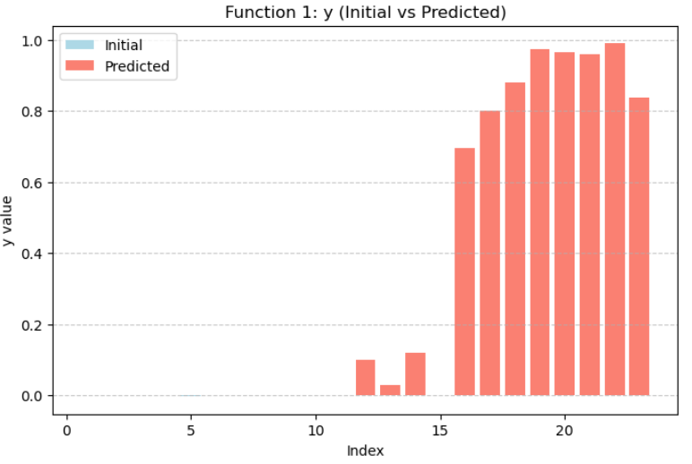
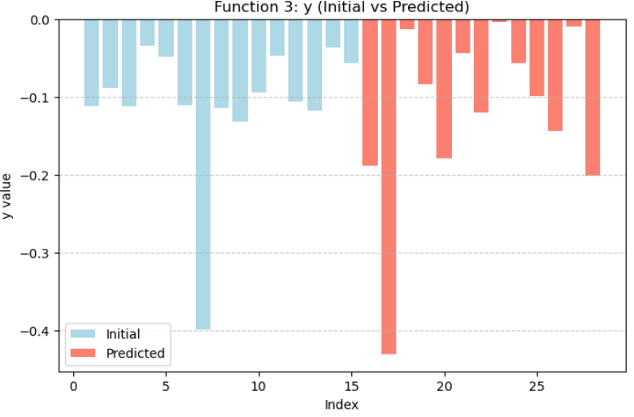
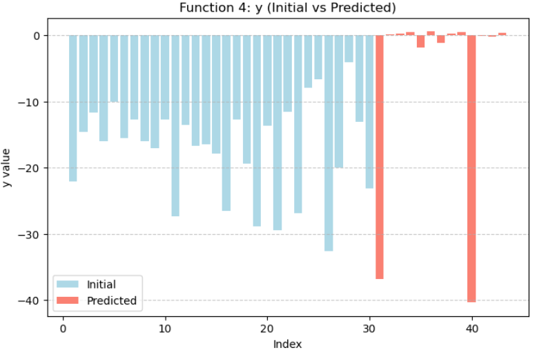
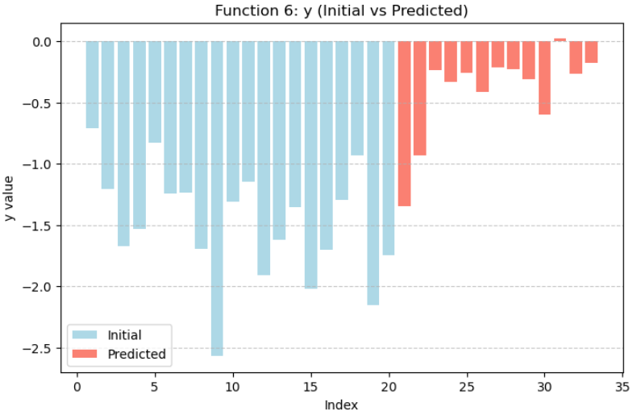
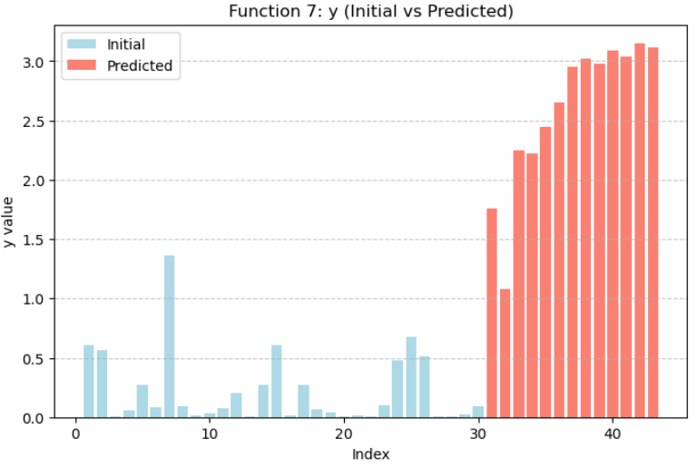
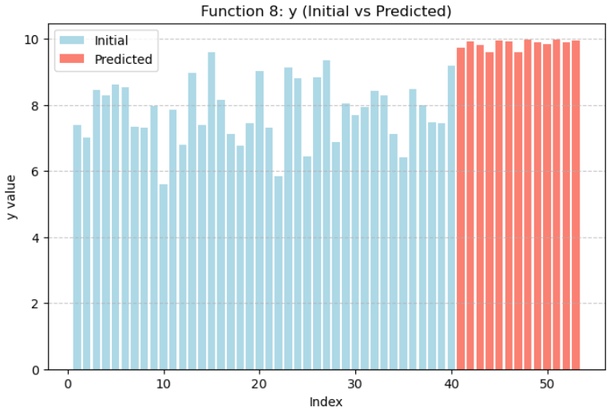

# Imperial College Capstone Project: Black-Box Optimisation (BBO) Challenge

## Project Overview
This repository contains my work for the **Black-Box Optimisation (BBO) Capstone Project**, completed as part of the **Imperial College Professional Certificate in Machine Learning and AI**.  

The challenge focuses on optimising a set of **unknown functions under strict query constraints and few observations**, where no information about the functional form, gradients or noise structure is available. The core objective is to **design a data-efficient query strategy** that balances exploration and exploitation to identify high-performing inputs with as few evaluations as possible.  

This mirrors many real-world ML problems where experiments are expensive, slow, or irreversible — e.g., hyperparameter tuning, engineering design, and scientific experimentation. The project strengthened my understanding of **surrogate modelling, acquisition strategies, and iterative model refinement**, skills that are directly applicable to optimisation and experimentation in industry.

---

## Problem Setting

### Inputs
- The system exposes **8 unknown objective functions**, each with a different input dimensionality.  
- Inputs are **real-valued vectors** constrained [0,1]
- The input dimensionality varies by function (from 2 to 8).  
- Queries must be submitted in a **strict formatted string**, with each value rounded to six decimal places:

### Outputs
- Each query returns a **scalar performance value**, rounded to six decimal places.  
- The objective function is **unknown** and treated as a black box.  
- Observations may include **noise** and are revealed only after submission.

---

## Data Example
**Sample input for an 8-dimensional function (`X`) and output (`y`):**  
```text
X = [0.665889, 0.123911, 0.877752, 0.778601, 0.142700, 0.349055, 0.845223, 0.711136]
y = 64.443444
```

---

## Repository Structure
- `model_card/` — Documentation describing model assumptions and limitations.  
- `datasheet/` — Data documentation for reproducibility and transparency.  
- *(Future additions)*: Code notebooks, scripts, and examples for submitting queries, surrogate modelling, and acquisition strategies.

---

## Key Skills Demonstrated
- Data‑efficient decision‑making under uncertainty
- Surrogate modelling with Gaussian Processes
- Exploration vs. exploitation trade‑offs
- Hyperparameter sensitivity analysis
- Applied optimisation in constrained, low‑data regimes

---

## Approach
The BBO problem was tackled using a **surrogate-based optimisation framework**. The workflow included:

1. **Surrogate Modelling**: A Gaussian Process (GP) surrogate was fitted to approximate the unknown objective function using observed query–evaluation pairs.
2. **Acquisition Strategy**: New query points were selected by balancing:
  - Exploration: reducing uncertainty about the function, and
  - Exploitation: querying points likely to improve upon the current best observation.
4. **Iterative Refinement**: Updating the surrogate model with new observations and repeating the acquisition cycle until query budget was exhausted.

This approach allows efficient identification of high-performing inputs with minimal queries, mimicking real-world scenarios such as hyperparameter tuning or engineering design optimization.

---

## Optimisation Methodology

This section describes the design choices, diagnostics, and heuristics adopted to construct a robust Bayesian optimisation strategy under severe data sparsity.

### 1. Data Preparation and Diagnostics
#### 1.1 Data Preprocessing
All input variables were provided **natively within the unit hypercube $$[0,1]^d$$** and therefore required no further rescaling. 
Output observations were **standardised** to zero mean and unit variance prior to fitting the Gaussian Process surrogate. This standardisation improved numerical stability and ensured well‑behaved kernel hyperparameter estimation under severe data sparsity.

#### 1.2 Visual Diagnostics and Exploratory Plots
To support model development and optimisation decisions, **several diagnostic visualisations were produced** throughout the process.

First, **bar plots** of the observed objective values \(y\) and their corresponding predictive uncertainties \(y_{\text{std}}\)​ were generated. These plots provide a quick visual assessment of the variability in observed outcomes and the relative uncertainty associated with different evaluations, helping to identify regimes where the surrogate model may be over‑ or under‑confident.

For low‑dimensional functions, additional **three‑dimensional visualisations** were constructed by plotting the observed function values over the input space. These plots offer intuitive insight into the local smoothness and curvature of the objective function, which in turn informed kernel choice and hyperparameter behaviour.

Finally, the **input locations X were visualised through pairwise scatter plots** across all dimension combinations. These plots illustrate how observations are distributed within the $$[0,1]^d$$ domain and highlight potential clustering effects. Recently proposed or selected points were emphasised to clarify how the optimisation trajectory evolved over time.

Overall, these visualisations served as **qualitative diagnostic tools**, enabling intuitive inspection of function geometry, uncertainty structure, and sampling coverage, and supporting informed kernel selection, ν‑adjustments and acquisition‑parameter choices.

#### 1.3 Input Correlation Checks
Before optimisation, pairwise **correlations between input dimensions** were inspected to identify strong dependencies. Although Gaussian Process surrogates can model correlated effects through kernel structure, high input correlation may distort length‑scale estimation and acquisition behaviour in low‑data regimes. No severe multicollinearity was observed, and no further input preprocessing was required.

### 2. Surrogate Modelling

#### 2.1 Kernel Hyperparameters $\ell$ and $\sigma$
Kernel hyperparameters were constrained within conservative bounds to avoid pathological fits under data sparsity. Length‑scales were bounded away from extremely small values to prevent overfitting noise, while the kernel variance was restricted to remain consistent with the standardised output scale.
Hyperparameters were optimised via marginal log‑likelihood within these bounds at each iteration.

#### 2.2 Matérn Smoothness Parameter ν: Local Geometry Matters
A **central challenge** in this project was accurately modelling sharp or highly localised maxima under severe data sparsity.
In standard Gaussian Process modelling, the Matérn smoothness parameter ν is typically tuned by maximising the marginal log‑likelihood, often **restricted to a neighbourhood around the current maximum** to ensure local relevance.

However, in this project such localised likelihood optimisation was not feasible due to the **very limited number of observations** near candidate optima. As a result, log‑likelihood maximisation had to be performed over the entire input domain.

In situations where the objective function is largely flat but contains a small, extremely sharp spike, global likelihood optimisation tends to favour overly smooth priors (e.g. high‑ν Matérn or RBF kernels). While these kernels explain the global structure well, they fail to capture the local geometry near narrow maxima, which is precisely the **region of greatest interest for optimisation**.

To address this issue, I adopted a local, **geometry‑informed strategy** for selecting ν, independent of global likelihood maximisation.
Local curvature around the current maximum was approximated using scale‑adjusted slopes to its k nearest neighbouring observations. 
Objective values y were standardised prior to slope computation to remove global scale effects and ensure comparability across neighbourhoods. 
Specifically, slopes were computed as absolute differences in function value divided by Euclidean distance from the current maximum, with distances rescaled by $$\sqrt{d}$$​ to obtain dimension‑consistent curvature estimates:

$$
s_i = \frac{|y_{\max} - y_i|}{\|x_i - x_{\max}\| / \sqrt{d}}
$$

The **key intuition** is that normalised distances from the current max reflect the severity of local curvature in the neighbourhood:

  - **Extremely large** slopes at very small distances indicate sharp spikes, favouring lower ν (rougher sample paths);
  - **Moderate slopes** at small distances indicate locally rough but smoother behaviour, favouring higher ν.

When strong local variation was observed near the maximum, the suggestions obtained by maximizing the log‑likelihood were overridden in favour of rougher Matérn kernels (e.g. ν = 0.5), which are better suited to modelling narrow, high‑curvature peaks.
This local ν‑selection strategy proved particularly important in later optimisation rounds, where a higher density of points near the current maxima was available and the strategy shifted toward more aggressive exploitation; in this phase, accurately modelling local structure around candidate optima was more critical than achieving a good global fit.

### 3. Acquisition Strategy

#### 3.1 Expected Improvement and the Exploration Parameter ξ
The exploration–exploitation trade-off in Expected Improvement was controlled through the parameter ξ. Smaller values bias the acquisition function toward exploitation by favouring points with high predicted objective value, whereas larger values place greater emphasis on uncertain regions of the design space.

In this work, ξ was adjusted empirically according to observed optimisation progress:

  - **ξ = 0.04** was used when broader exploration was required due to higher uncertainty or reduced confidence in local surrogate accuracy.
  - **ξ = 0.01** was used for routine local refinement around promising regions.
  - **ξ = 0.001** was used during strongly exploitative phases, particularly when several candidate points were located close to     the current best solution according to a normalised distance criterion.


This adaptive strategy was adopted to balance efficient convergence with adequate global search.

### 4. Query Selection via Multi‑Resolution Local Search
At every optimisation step, the current best point served as the centre of a multi‑resolution local search. A hierarchy of shrinking neighbourhoods was explored, within which candidate points were generated deterministically as Cartesian products of low‑resolution local grids around the incumbent solution. Expected Improvement was repeatedly maximised over these locally generated candidates, progressively refining the incumbent solution before committing to the next function evaluation.

### 5. Final Results: Function-wise Optimisation Outcomes
Across all functions, the optimisation procedure consistently identified solutions with objective values higher than those observed in the initial samples, demonstrating reliable improvement and effective exploration–exploitation balancing across all problem instances.


<p align="center">
  
</p>

<p align="center">
  
</p>

<p align="center">
  
</p>

<p align="center">
  
</p>

<p align="center">
  
</p>

<p align="center">
  
</p>

<p align="center">
  
</p>

<p align="center">
  
</p>

<em>
Figure X: Objective values (initial vs predicted samples) across all functions, showing consistent improvements over initial evaluations and demonstrating effective optimisation performance across different problem instances.
</em>
