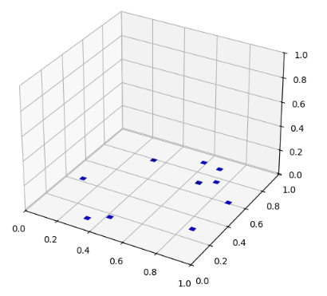
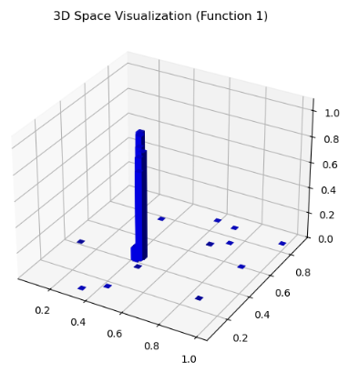

## Function 1

### Initial Observations
The function has two input dimensions, with 10 initial (x,y) observations.
Function 1 initially appeared extremely flat, with early evaluations yielding objective values close to zero across most of the input domain. This lack of informative variation made it difficult to identify promising regions in the initial stages and required an explicitly exploratory optimisation strategy to locate a meaningful maximum while avoiding noise‑dominated fluctuations.

<p align="center">
  
</p>
<em>Figure 1: Early evaluations show a predominantly flat objective surface, providing limited guidance for optimisation and motivating an exploratory sampling strategy.</em>

### Observed Behaviour
The first observations in the "central" unexplored" area quickly showed a tiny but very high spike in the region.

### Effective Optimisation Choices
This function highlights the limitations of maximising the marginal log‑likelihood (MLL) over the entire input domain when the objective is dominated by large flat regions. Global likelihood optimisation consistently favoured very smooth kernels, effectively RBF‑like behaviour:
```
MLL ν = 0.5   : −18.3230
MLL ν = 1.5   :  −9.6884
MLL ν = 2.5   :  −5.8451
MLL (RBF)     :  −1.7110  
```
While these kernels accurately captured the predominantly flat structure of the domain, they systematically failed to represent the narrow, high‑curvature spike where the objective maximum resides.

To assess local structure, nearest‑neighbour analysis around the incumbent maximum was performed. This revealed extremely large local gradients over very small normalised distances, strongly indicating the presence of sharp curvature.
Here, y denotes the observed objective value at each sampled location, ordered by increasing normalised distance from the incumbent maximum:

| obj. value (y)      | distance (norm.) | slope |
|:---------:|:---------------:|:-----:|
| 0.9737 | 0.0018 | 1666.7 |
| 0.9657 | 0.0018 | 1681.8 |
| 0.9607 | 0.0022 | 1382.0 |
| 0.8811 | 0.0053 |  643.0 |
| 0.8020 | 0.0078 |  486.5 |

Based on this empirical evidence, the Matérn smoothness parameter was deliberately reduced to a rougher configuration (ν = 0.5). This adjustment enabled the surrogate to model the sharp local feature governing optimisation performance, at the expense of global smoothness that was irrelevant to the task.

Once the spike had been reliably identified and localised, the optimisation strategy transitioned from broad exploration to aggressive exploitation by increasing the Expected Improvement emphasis on local refinement.

### Best Observed Solution
```
y: 0.990274
X: 0.422000-0.419516
```

<p align="center">
  
</p>
<em>Figure 2: Final evaluations localised a narrow spike surrounded by an otherwise flat objective region.</em>

<br><br>

<p align="center">
  
</p>

<em>Figure 1: Objective values (initial vs predicted samples), showing the trajectory of evaluations during the optimisation process.</em>
