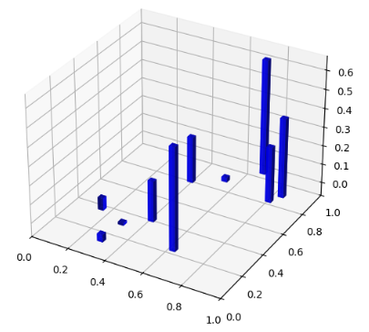
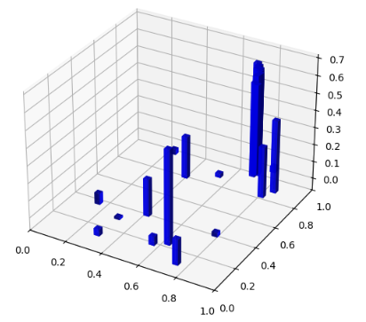
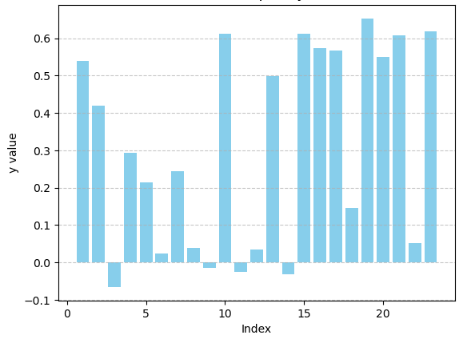

## Function 2

### Initial Observations
Function X exhibited moderate variability already during the initial evaluations, with objective values spanning both positive and slightly negative ranges. This suggested the presence of informative signal beyond pure noise. However, the sparse sampling density provided no clear indication of the global structure or of dominant regions of interest. Consequently, early optimisation required a deliberately exploratory strategy to distinguish consistent trends from local fluctuations and to avoid premature exploitation based on insufficient spatial information.

<p align="center">
  
</p>
<em>Figure 1: 3D visualisation of the function over the input space, illustrating mainly two major local variations under sparse initial sampling.</em>

### Observed Behaviour
Subsequent exploration revealed two main regions of interest within the search space. Both exhibited locally improved objective values, although their relative potential remained uncertain for several rounds. Only in the final submission did the optimisation decisively exploit the region exhibiting the higher maximum objective value.

### Effective Optimisation Choices
Maximisation of the marginal log‑likelihood (MLL) did not indicate a clear preferred model configuration throughout the submissions, reflecting the evolving balance between global exploration and local refinement.
In the later stages, the increased concentration of samples around the current maxima revealed steep local gradients at small normalised distances. This justified the use of lower values of the smoothness parameter ν, enabling the model to better capture sharp local variations without excessive smoothing.

| obj. value (y)      | distance (norm.) | slope | 
|:---------:|:---------------:|:-----:|
  0.6194   |     0.0066      |  493.3976 
  0.6070   |     0.0116      |  286.5934 
  0.6110   |     0.0186      |  176.9395 
  0.5508   |     0.0193      |  185.6320 
  0.5667   |     0.0234      |  149.9327 

Broad exploration was therefore sustained for multiple rounds, driven by both the size of the search space and the presence of two promising but separate regions. Exploitation was deferred until the later stages, once sufficient evidence had accumulated to confidently prioritise the superior region.

### Best Observed Solution
```
y: 0.652834
X: 0.604386-0.086465
```

<p align="center">
  
</p>
<em>Figure 2: Overall, the optimisation process reflects a function with weak global structure and a highly localised optimum, requiring prolonged exploration to reliably identify promising regions and carefully timed exploitation to capture the final maximum.</em>

<p align="center">
  
</p>
<em>Figure 3: Bar plot of the final objective values (y), showing limited variability and the absence of any dominant high‑value spike across evaluations.</em>
