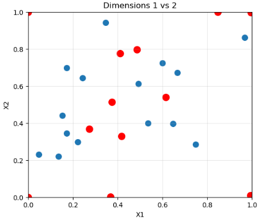
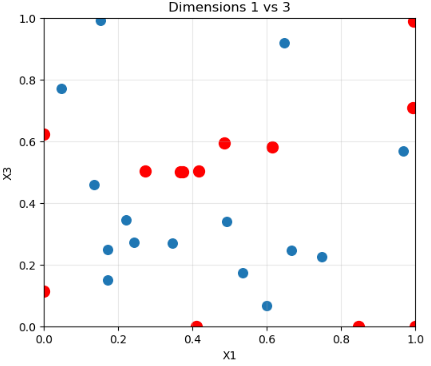
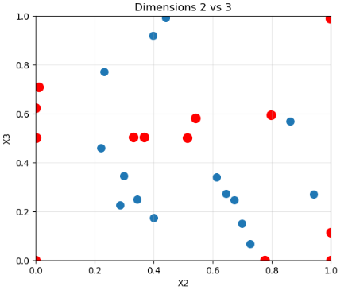

## Function 3

### Initial Observations
The function has three input dimensions, with 15 initial (x,y) observations.
Initial evaluations yield objective values in the range [−0.40, −0.03], with most observations concentrated near −0.10, suggesting low variance and no early evidence of a clearly dominant region.

### Observed Behaviour
Subsequent rounds favoured exploration due to the sparsity of the data and the absence of a clear region of interest. Only in the final submission did the optimisation decisively exploit the region exhibiting the highest objective values, which were close to zero.

### Effective Optimisation Choices
Maximisation of the marginal log‑likelihood (MLL) did not indicate a clearly preferred model configuration throughout the submissions, reflecting the evolving balance between global exploration and local refinement. Due to the predominantly exploratory approach, no significant concentration of samples emerged around the current maxima. Consequently, the smoothness parameter ν was maintained at a standard value of 2.5.

<p align="center">
  
</p>

<p align="center">
  
</p>

<p align="center">
  
</p>

<p align="center">
  <em>
    Figure 1: Pairwise scatter plots of the input points, illustrating the exploratory
    sampling strategy (blue points: initial evaluations; red points: subsequent submissions).
  </em>
</p>

### Best Observed Solution
```
y = −0.003369
X = [0.410367, −0.775143, 0.000000]
```
