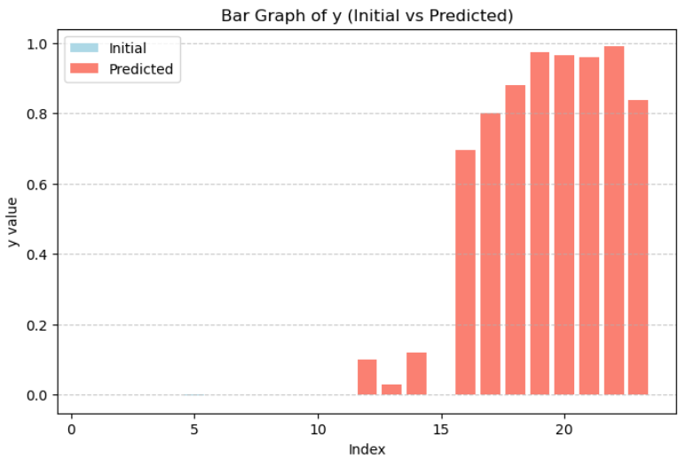

## Function 5

### Initial Observations
The function operates over a four-dimensional input space and is initially evaluated using 20 (x, y) observations. Among the eight benchmark functions considered, Function 5 exhibits the widest dispersion in output values at the initial sampling stage, with a mean response of approximately 151.

A notable early maximum is observed:
```
y: 1,088.85962
X: 0.22418902-0.84648049-0.87948418-0.87851568
```
This suggests the presence of highly localized regions of elevated function value within the domain. The corresponding input configuration indicates that extreme values may arise near boundary regions of the search space.

### Observed Behaviour
Early exploration revealed that naïve exploitation strategies are likely to converge prematurely to suboptimal regions.
In particular, several high-performing regions were identified near the very boundaries of the input domain. These regions appeared disconnected and spatially separated, indicating that the objective function contains multiple isolated basins of attraction.
An initial exploratory sampling strategy proved essential in identifying these regions, as early convergence toward any single peak would have resulted in suboptimal performance.

### Effective Optimisation Choices
Maximisation of the marginal log-likelihood (MLL) over the full input domain did not yield a clearly dominant kernel configuration. Given the relatively limited number of evaluations (20 initial observations, increasing to 32 prior to final submission) in a four-dimensional space, MLL-based selection was treated as indicative rather than decisive in this case.
Moreover, the limited density of observations around the current best regions prevented the use of nearest-neighbour-based adaptive tuning strategies, due to the number of promising regions identified and explored.
As a result, the Matérn kernel smoothness parameter was fixed to a "standard" and robust setting of v=2.5

### Best Observed Solution
```
y: 8662.4825
X: 1.000000-1.000000-1.000000-1.000000
```
This result indicates that the global optimum lies at the extreme boundary of the input space, reinforcing earlier observations that high-value regions tend to concentrate at domain edges.

<p align="center">
  
</p>
<em>Figure 1: Objective values (initial vs predicted samples), showing the trajectory of evaluations during the optimisation process.</em>
